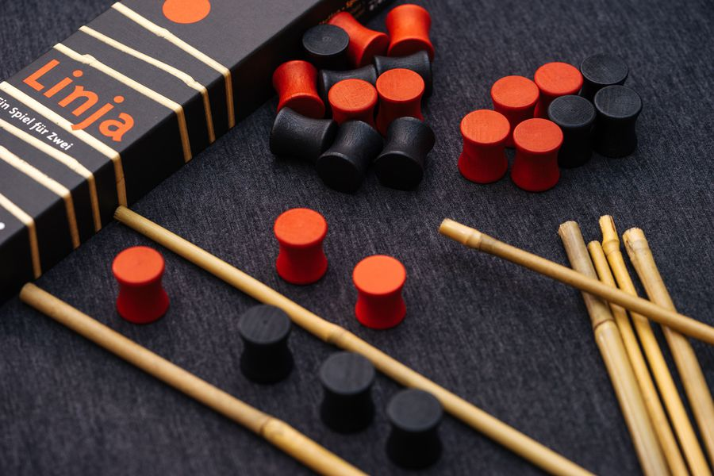

# Linja
*A.I for the game of linja*

This is a simple minimax AI for the game of [linja](https://boardgamegeek.com/boardgame/15209/linja).
It assumes that black goes first and plays black.

__Description of the game:__

*Both players start with six pawns in their base and with one pawn in each of the six spaces between both bases. The goal of the game is to place your pawns in the opponent's home base or as near as possible to it.
During a turn, a player has one move that consists of first moving one pawn one space towards the other player's base. Then, he can choose to move any of his pawns as many spaces as the number of pawns in the space that the first pawn was moved into.
Game components are red and black wooden pawns and seven bamboo sticks to create the playing field.*

Rules of the game can be found [here (pdf)](LinjaRules.pdf).
